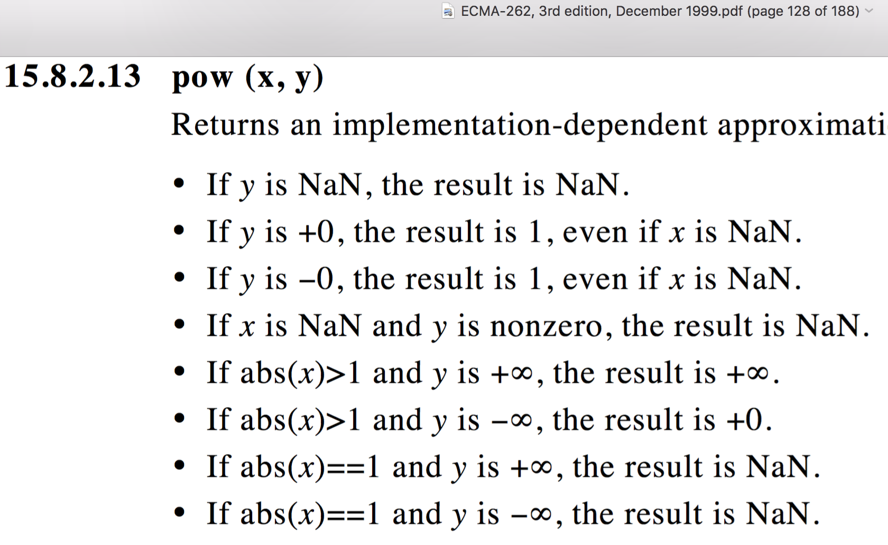
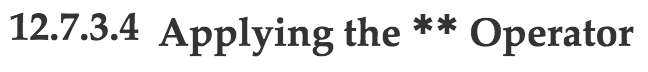
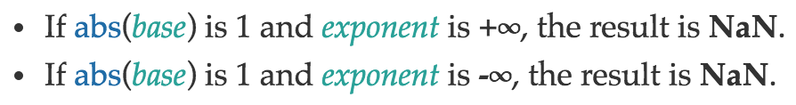
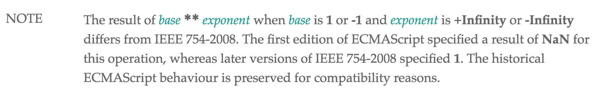

# NaN

---

# "NaN" stands for:
# Not a Number

---

## What kinds of things give us NaN?

---
## Fuzzy math
```javascript
console.log(
  0 / 0,
  Infinity / Infinity,
  0 * Infinity,
  Infinity - Infinity
);
```
```
> NaN NaN NaN NaN
```

---

## Complex Numbers
```javascript
console.log(
  Math.sqrt(-1),
  Math.log(-1),
  Math.acos(2),
  Math.asin(2)
);
```
```
> NaN NaN NaN NaN
```

---

## Turning things into Numbers
```javascript
console.log(
  parseInt('hello'), parseFloat('world'),
  Number(undefined), Number({}),
  +undefined, +{},
  +new Date('hello')
);
```
```
> NaN NaN NaN NaN NaN NaN NaN
```

---

## What *is* NaN? (in JavaScript)

---

## "Not a Number" is...
```javascript
console.log(NaN);
```
```
> NaN
```
... a particular JavaScript value.

(*very* particular)

---

## "Not a Number" is...
```javascript
console.log(typeof NaN);
```
```
> number
```
...a Number.

---


---

## "Not a Number" is...
```javascript
console.log(NaN === NaN);
```
```
> false
```
...not "Not a Number".

---


---

## "Not a Number" is...
```javascript
var assert = require('assert');
assert.equal(NaN, NaN);
```
```
> AssertionError: NaN == NaN
```
...tricky to test.

---

# "NaN" actually stands for:
# Not a NaN

---


---

## So how do we tell if something is NaN?

---

## Easy! Just use the `isNaN` function:
```javascript
console.log(isNaN(NaN));
```
```
> true
```

---

## Or maybe not...
```javascript
console.log(isNaN('foo'), isNaN(['bar']), isNaN({}));
```
```
> true true true
```
```javascript
console.log(typeof 'foo', typeof ['bar'], typeof {});
```
```
> string object object
```
---


---

## So let's just make our own:
```javascript
function myIsNaN(x) {
  return typeof x === 'number' && isNaN(x);
}

console.log([NaN, 'foo', ['bar'], {}].map(isNaN));
console.log([NaN, 'foo', ['bar'], {}].map(myIsNaN));
```
```
> true true true true
> true false false false
```

---

## Or we can recall "Not a NaN":
```javascript
function myIsNaN(x) {
  return x !== x;
}

console.log([NaN, 'foo', ['bar'], {}].map(isNaN));
console.log([NaN, 'foo', ['bar'], {}].map(myIsNaN));
```
```
> true true true true
> true false false false
```

---

## This works because `NaN` is the *only* value in JavaScript for which the equality operator is *non-reflexive*.

---

## Fortunately, Number.isNaN was added in ES2015:
```javascript
console.log(Number.isNaN(NaN), isNaN(NaN),
  Number.isNaN('hello'), isNaN('hello'),
  Number.isNaN(['hello']), isNaN(['hello']),
  Number.isNaN({}), isNaN({})
);
```
...and it does what we want:

```
> true true false true false true false true
```

---

## But NaN isn't just a JavaScript thing...

---

## NaN is actually defined by the IEEE 754 floating-point standard.

---

## If you understand NaN in one language, you probably understand it in most.

---

## Fun fact about that...

---

## The IEEE 754 spec defines the `pow` function:
```
pow(0, 0) == 1
pow(Infinity, 0) == 1
pow(1, Infinity) == 1
```
This behavior is inherited from C99 and POSIX 2001.

Most languages follow this.

---

# Most.

---

## Here's what Python does:
```python
[0 ** 0, float("inf") ** 0, 1 ** float("inf")]
```
```
> [1 1.0 1.0]
```

---

## And Ruby:
```ruby
[0 ** 0, Float::INFINITY ** 0, 1 ** Float::INFINITY]
```
```
> [1 1.0 1.0]
```

---

# But JavaScript?

---

```javascript
Math.pow(0, 0);
```

---

```javascript
Math.pow(0, 0);
```
```
> 1
```

---

```javascript
Math.pow(0, 0);
```
```
> 1
```
```javascript
Math.pow(Infinity, 0);
```

---

```javascript
Math.pow(0, 0);
```
```
> 1
```
```javascript
Math.pow(Infinity, 0);
```
```
> 1
```

---

```javascript
Math.pow(0, 0);
```
```
> 1
```
```javascript
Math.pow(Infinity, 0);
```
```
> 1
```
```javascript
Math.pow(1, Infinity);
```

---

```javascript
Math.pow(0, 0);
```
```
> 1
```
```javascript
Math.pow(Infinity, 0);
```
```
> 1
```
```javascript
Math.pow(1, Infinity);
```
```
> NaN
```

---


---

#[fit] Why?

---



---




---

- ES`1` specifies `pow`: 1997
- C99 specifies `pow`: 1999
- POSIX specifies `pow`: 2001
- IEEE 754 inherits `pow`: 2008

---



---

## So just like every other question about JavaScript, the answer is...

---

#[fit] Backwards
#[fit] compatibility

---

## So anyway, what does IEEE 754 say about how we represent NaN?

---

## Bit representation of a float32 value:

* 1-bit sign
* 8-bit exponent, offset by `127`
* 23-bit significand
* `(-1) ^ s * 2 ^ (exp - 127) * 1.significand`

Note: the significand is actually 24 bits, but only 23 are explicitly stored.

---

## Example float32 value:
```
0 10000000 01000000000000000000000
```

- `(-1) ^ 0 = 1`
- `2 ^ (10000000b - 127) = 2`
- `1.01b = 1.25`
- `1 * 2 * 1.25 = 2.5`

---

## Bit representations of special values:
```
0 11111111 00000000000000000000000 -> Infinity
1 11111111 00000000000000000000000 -> -Infinity
0 11111111 10000000000000000000000 -> NaN
```

NaN values have a maximized exponent and a nonzero significand.

---

## So these are also all NaN:
```
1 11111111 10000000000000000000000 -> NaN (quiet, negative)
0 11111111 10000000000000000000001 -> NaN (quiet, but different)
0 11111111 00000000000000000000001 -> NaN (signaling)
0 11111111 00000000000000000000010 -> NaN (signaling, but different)
0 11111111 00000000000000000000011 -> NaN (we can start counting!)
```

---

## So these are also all NaN:
```
1 11111111 10000000000000000000000 -> NaN (quiet, negative)
0 11111111 10000000000000000000001 -> NaN (quiet, but different)
0 11111111 00000000000000000000001 -> NaN (signaling)
0 11111111 00000000000000000000010 -> NaN (signaling, but different)
0 11111111 00000000000000000000011 -> NaN (we can start counting!)
```

How many NaNs are there, really?

---

# 2^24 - 2 = *16777214*

---

## And that's just with a float32!
## What about a double64?

---

# 2^52 - 2 = *4503599627370494*

---

## That's 4.5 * 10^15, or 4.5 quadrillion.

## 4.5 petabytes is about 10,000 years worth of music.

---

## If there are so many different possible NaNs, then it only seems reasonable...

---

## ...that one NaN is unlikely to be the same as another NaN!

---

# Thus, NaN !== NaN.

---

## Some Related Links
* http://ariya.ofilabs.com/2014/05/the-curious-case-of-javascript-nan.html
* http://www.2ality.com/2012/02/nan-infinity.html
* https://en.wikipedia.org/wiki/NaN

---

## Who are you and where can I find the slides?
* I'm Lewis J Ellis: @lewisjellis on [Twitter](https://twitter.com/lewisjellis) and [GitHub](https://github.com/lewisjellis)
* My website is [LewisJEllis.com](http://lewisjellis.com).
* Slides available at [GitHub.com/LewisJEllis/nantalk](https://github.com/lewisjellis/nantalk)
