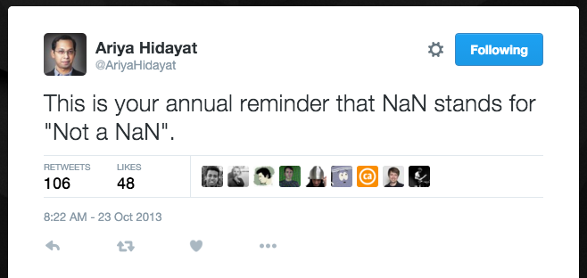

# NaN

---

# "NaN" stands for:
# Not a Number

---

## What kinds of things give us NaN?

---
## Fuzzy math
```javascript
console.log(
  0 / 0,
  Infinity / Infinity,
  0 * Infinity,
  Infinity - Infinity,
  Math.pow(1, Infinity)
);
```
```
> NaN NaN NaN NaN NaN NaN
```

---

## Complex Numbers
```javascript
console.log(
  Math.sqrt(-1),
  Math.log(-1),
  Math.acos(2),
  Math.asin(2)
);
```
```
> NaN NaN NaN NaN
```

---

## Turning things into Numbers
```javascript
console.log(
  parseInt('hello'), parseFloat('world'),
  Number(undefined), Number({}),
  +{}, +undefined,
  +new Date('hello')
);
```
```
> NaN NaN NaN NaN NaN NaN
```

---

## What *is* NaN? (in JavaScript)

---

## "Not a Number" is...
```javascript
console.log(NaN);
```
```
> NaN
```
... a particular JavaScript value.

(*very* particular)

---

## "Not a Number" is...
```javascript
console.log(typeof NaN);
```
```
> number
```
...a Number.

---


---

## "Not a Number" is...
```javascript
console.log(NaN === NaN);
```
```
> false
```
...not "Not a Number".

---


---

## "Not a Number" is...
```javascript
var assert = require('assert');
assert.equal(NaN, NaN);
```
```
> AssertionError: NaN == NaN
```
...tricky to test.

---

# "NaN" also stands for:
# Not a NaN

---



---

## So how do we tell if something is NaN?

---

## Easy! Just use isNaN:
```javascript
console.log(isNaN(NaN));
```
```
> true
```

---

## Or maybe not...
```javascript
console.log(isNaN('hello'), isNaN(['hello']), isNaN({}));
```
```
> true true true
```
```javascript
console.log(typeof 'hello', typeof ['hello'], typeof {});
```
```
> string object object
```
---


---

## So let's just make our own:
```javascript
function myIsNaN(x) {
  return typeof x === 'number' && isNaN(x);
}

console.log(myIsNaN(NaN), isNaN(NaN),
  myIsNaN('hello'), isNaN('hello'),
  myIsNaN(['hello']), isNaN(['hello']),
  myIsNaN({}), isNaN({})
);
```
```
> true true false true false true false true
```

---

## Or we can recall "Not a NaN":
```javascript
function myIsNaN(x) {
  return x !== x;
}

console.log(myIsNaN(NaN), isNaN(NaN),
  myIsNaN('hello'), isNaN('hello'),
  myIsNaN(['hello']), isNaN(['hello']),
  myIsNaN({}), isNaN({})
);
```
```
> true true false true false true false true
```

---

## This works because NaN is the *only* non-reflexive value in JavaScript.

---

## Number.isNaN was added recently:
```javascript
console.log(Number.isNaN(NaN), isNaN(NaN),
  Number.isNaN('hello'), isNaN('hello'),
  Number.isNaN(['hello']), isNaN(['hello']),
  Number.isNaN({}), isNaN({})
);
```
...and it does what we want:

```
> true true false true false true false true
```

---

## But NaN isn't just a JavaScript thing...

---

## NaN is actually defined by the IEEE754 floating-point standard.

---

## Bit representation of a float32 value:

* 1-bit sign
* 8-bit exponent
* 23-bit significand

```
0 10000000 01000000000000000000000 -> 2.5
```

Note: the significand is actually 24 bits, but only 23 are explicitly stored.

---

## Bit representations of special values:
```
0 11111111 00000000000000000000000 -> Infinity
1 11111111 00000000000000000000000 -> -Infinity
0 11111111 10000000000000000000000 -> NaN
```

NaN values have a maximized exponent and a nonzero significand.

---

## So these are also all NaN:
```
1 11111111 10000000000000000000000 -> NaN (quiet, negative)
0 11111111 10000000000000000000001 -> NaN (quiet, but different)
0 11111111 00000000000000000000001 -> NaN (signaling)
0 11111111 00000000000000000000010 -> NaN (signaling, but different)
0 11111111 00000000000000000000011 -> NaN (we can start counting!)
```

How many NaNs are there, really?

---

# 2^24 - 2 = *16777214*

---

## And that's just with a float32!
## What about a double64?

---

# 2^52 - 2 = *4503599627370494*

---

## That's 4.5 * 10^15, or 4.5 quadrillion.

## 4.5 petabytes is about 10,000 years worth of music.

---

## If there are so many different possible NaNs, then it only seems reasonable...

---

## ...that one NaN is unlikely to be equal to another NaN!

---

# Thus, NaN !== NaN.

---

## Some Related Links
* http://ariya.ofilabs.com/2014/05/the-curious-case-of-javascript-nan.html
* http://www.2ality.com/2012/02/nan-infinity.html
* https://en.wikipedia.org/wiki/NaN

---

## Who are you and where can I find the slides?
* I'm Lewis J Ellis: @lewisjellis on [Twitter](https://twitter.com/lewisjellis) and [GitHub](https://github.com/lewisjellis)
* My website is [LewisJEllis.com](http://lewisjellis.com).
* Slides available at [GitHub.com/LewisJEllis/nantalk](https://github.com/lewisjellis/nantalk)
